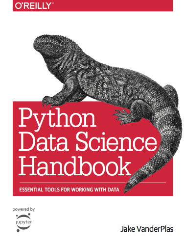

# 파이썬 데이터 사이언스 핸드북 {.unnumbered}

{width=300px}

이 웹사이트는 Jake VanderPlas의 저서인 [파이썬 데이터 사이언스 핸드북](http://shop.oreilly.com/product/0636920034919.do) 전문을 제공합니다. 책의 원본 내용은 [GitHub](https://github.com/jakevdp/PythonDataScienceHandbook)에서 Jupyter 노트북으로도 확인할 수 있습니다.

본문 텍스트는 [CC-BY-NC-ND 라이선스](https://creativecommons.org/licenses/by-nc-nd/3.0/us/legalcode)로 배포하며, 코드는 [MIT 라이선스](https://opensource.org/licenses/MIT)를 따릅니다.

이 자료가 도움이 되었다면 [책을 구매하여](http://shop.oreilly.com/product/0636920034919.do) 저자의 활동을 응원해 주시기 바랍니다!

